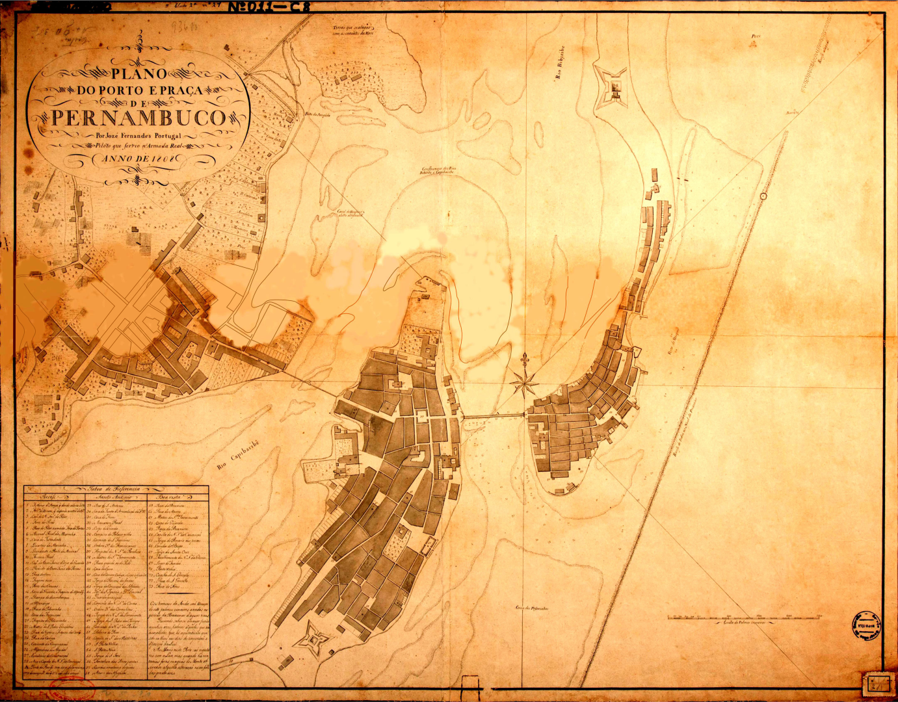

# map-synth

This is a database used for map-to-satellite image translation. This set was developed for a study at Universidade de Pernambuco, 2020.

## Contents

- **try 1**: Contains images with less labels and mostly on an urban setting.
- **try 2**: Contains images with more labels and mostly on an environmental setting.
- **no_labels**: Contains images with no label.

For each subset, there are segmentation test samples for the purpose of generating the final mosaic sliced from **recife1808.png**.

